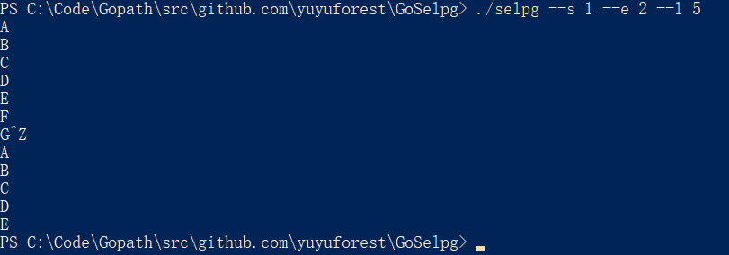

# 任务

用 Go 语言实现一个类 selpg 程序，关于该程序的详细介绍，可见：[开发Linux命令行实用程序](https://www.ibm.com/developerworks/cn/linux/shell/clutil/index.html#artrelatedtopics)

该程序的 C 语言源码实现：[selpg.c](https://www.ibm.com/developerworks/cn/linux/shell/clutil/selpg.c)

selpg 的用法如下：

```
selpg --s startPage --e endPage [ --f | --l pageLength] [--d destination] [inputFile]
```

# 先行知识

在这里先集中简要介绍一下本次项目所用到的和 Go 编程相关的知识，以便以后自己回溯。

## flag与pflag

参考了这篇文章：[Golang之使用Flag和Pflag](https://o-my-chenjian.com/2017/09/20/Using-Flag-And-Pflag-With-Golang/)

Go 语言的 `flag` 包，可以用来解析命令行选项参数。

**将选项参数绑定到一个变量**

```go
var tmp int

flag.IntVar(&tmp, "s", -1,"first page to be printed")
```

`flag.IntVar` 的第一个参数是变量的地址，第二个参数是命令行参数名，第三个参数是对应的默认值，第四个参数是对用法的解释说明。

也可以以下列方式来绑定：

```go
var tmp = flag.Int("s", -1,"first page to be printed")
```

这里的 `Int` 还可以换成其他类型，比如 `string` ，`bool`。

**布尔类型的参数**

布尔类型的参数，不需要在命令行里在选项参数后面附加值。

在下面这个例子中，只要命令行输入 `--f` ，这个参数的值就会置为与设置的默认值 `false` 相反的值 `true`。

```go
flag.BoolVar(&tmp, "f",false,"delimit pages by form feeds")
```

**解析参数**

```go
flag.Parse()
```

注意，解析到第一个非选项参数就会停止，即便这个非选项参数后面还有别的选项参数。

**自定义对命令行参数的总体说明**

`flag.Usage` 是一个函数类型的变量，调用先前绑定命令行参数的变量，来输出默认格式的命令用法说明。

可以将自定义的函数赋给它，这样 `flag` 包解析后就会使用这个自定义函数来输出用法说明（如果命令行参数有误的话）。

值得一提的是，如果在 `flag` 包解析后才将自定义的 `Usage` 赋给 `flag.Usage` ，则输出的用法说明还是原来的默认格式，因为解析时就已经调用了默认的 `flag.Usage` 。

```go
func Usage(){
	fmt.Println("Usage of selpg: selpg --s startPage --e endPage [ --f | --l pageLength] [--d destination] [inputFile]\n",
		"\t--s int\t\tfirst page to be printed\n",
		"\t--e int\t\tfirst page not printed after several continuous printed pages\n",
		"\t--f\t\tdelimit pages by form feeds\n",
		"\t--l int\t\tnumber of lines per page (default 72)\n",
		"\t--d string\tdestination printer")
}
```

```go
flag.Usage = Usage
```

**使用 `flag` 包时，命令行参数的格式**

```
-flag xxx （使用空格，一个 - 符号） 
–flag xxx （使用空格，两个 - 符号） 
-flag=xxx （使用等号，一个 - 符号） 
–flag=xxx （使用等号，两个 - 符号）
```

**`pflag` 包**

可以通过以下形式来引入 `pflag` 包：

```go
import flag "github.com/spf13/pflag"
```

`pflag` 的用法基本与 `flag` 包相同，但功能更强大。

**使用 `pflag` 包时，命令行参数的格式**

```
--flag    // 布尔flags, 或者非必须选项默认值
--flag x  // 只对于没有默认值的flags
--flag=x
```

## 异常处理

Go 语言中的 `panic` `recover`异常处理机制，与 C++ / Java 中的 `try` `catch` 异常处理机制有些类似。

`panic` 抛出异常后，被延期到外部函数结束时才执行的 `recover` 函数会收集被抛出的异常并处理。

`panic` 后的代码不再执行。

```go
function f {
  	defer func() {
		if err := recover(); err != nil {
			fmt.Println(err)
			os.Exit(1)
		}
	}()
  
    // ...
    panic(tmp)
  	// ...
}
```

在这个例子中，你可以把一个字符串型变量传给 `panic()` 。

## 缓冲区和文件读写

**缓冲区**

```go
var writer bytes.Buffer
```

如果要向缓冲区内写入一个字符串，可以：

```go
writer.WriteString(page)
```

**打开一个文件流**

这个函数会返回两个参数，第一个是文件流，第二个是其间产生的错误。

```go
file, err := os.Open(psa.inputFile)
defer file.Close()
```

**读文件**

- 由文件流创建 `bufio.Reader`

```go
var reader *bufio.Reader
reader = bufio.NewReader(file)
```

- 一直读入，直到遇到指定的分隔符。这个函数会返回两个参数，第一个是已经读入的字符串，第二个是错误。

```go
// bufio.go
// func (b *Reader) ReadString(delim byte) (string, error)

page, err := reader.ReadString('\f')
```

读入了字符串后，就可以把字符串写到缓冲区了。缓冲区为我们在输入和输出之间架起了桥梁。

**写文件**

- 把缓冲区里的内容输出到标准输出

```go
fmt.Fprint(os.Stdout, writer.String())
```

- 把缓冲区里的内容输出到指定文件，下面的第三个参数是文件权限

```go
// ioutil.go
// func WriteFile(filename string, data []byte, perm os.FileMode) error

ioutil.WriteFile("test-pageLength", writer.Bytes(), syscall.O_CREAT)
```

# 程序逻辑及实现

## main

根据 selpg 程序的工作原理，我们可以把主程序从逻辑上划分为3个部分：

- 绑定命令行参数并解析
- 检查参数
- 读取输入，进行输出

```go
func main() {
	var sa SelpgArgs

	flag.Usage = Usage

	flag.IntVar(&sa.startPage, "s", -1,"first page to be printed")
	flag.IntVar(&sa.endPage, "e",-1,"first page not printed")
	flag.IntVar(&sa.pageLength, "l",72,"number of lines per page")
	flag.BoolVar(&sa.formFeed, "f",false,"delimit pages by form feeds")
	flag.StringVar(&sa.destination, "d", "", "destination printer")

	flag.Parse()

	processArgs(&sa, flag.Args(), os.Args[1:])
	processInput(&sa)
}
```

### 定义结构体以存放命令行参数

```go
/* special type determined for saving arguments */
type SelpgArgs struct {
	startPage int
	endPage int
	pageLength int
	formFeed bool
	destination string
	inputFile string
}
```

### 绑定命令行参数并解析

声明一个 `SelpgArgs` 结构体变量，将命令行参数绑定到该结构体内的成员。

```go
func Usage(){
	fmt.Println("Usage of selpg: selpg --s startPage --e endPage [ --f | --l pageLength] [--d destination] [inputFile]\n",
		"\t--s int\t\tfirst page to be printed\n",
		"\t--e int\t\tfirst page not printed after several continuous printed pages\n",
		"\t--f\t\tdelimit pages by form feeds\n",
		"\t--l int\t\tnumber of lines per page (default 72)\n",
		"\t--d string\tdestination printer")
}
```

```go
var sa SelpgArgs

flag.Usage = Usage

flag.IntVar(&sa.startPage, "s", -1,"first page to be printed")
flag.IntVar(&sa.endPage, "e",-1,"first page not printed")
flag.IntVar(&sa.pageLength, "l",72,"number of lines per page")
flag.BoolVar(&sa.formFeed, "f",false,"delimit pages by form feeds")
flag.StringVar(&sa.destination, "d", "", "destination printer")

flag.Parse()
```

### 检查参数

需要检查：

- `startPage` / `endPage` / `pageLength` 是否有意义
- `--f` 与 `--l pageLength` 是否均被指明
- 是否指定了多于一个的输入文件

如果有错误，则输出到终端。

```go
/* check arguments */
func processArgs(psa *SelpgArgs , nonFlags []string, allArgs []string) {

	findL := func() bool {
		for i := 0; i < len(allArgs); i++ {
			if allArgs[i] == "--l" {
				return true
			}
		}
		return false
	}

	defer func() {
		if err := recover(); err != nil {
			fmt.Println(err)
			os.Exit(1)
		}
	}()

	// check option arguments: --s--e --l --f
	switch {
	case psa.startPage < 1 :
		panic("selpg: Valid start page number does not exist.")
	case psa.endPage < 1 :
		panic("selpg: Valid end page number does not exist.")
	case psa.endPage < psa.startPage :
		panic("selpg: The end page number should be not smaller than the start page number.")
	case psa.pageLength < 1 :
		panic("selpg: Invalid page length.")
	case psa.formFeed && (psa.pageLength != 72 || findL()):
		panic("selpg: Only one way of delimiting pages can be chosen.")
	}

	// check non-option arguments: inputFile
	switch l := len(nonFlags); {
	case l > 1 :
		panic("selpg: There should be at most one input file.")
	case l == 1 :
		psa.inputFile = nonFlags[0]
	}
}
```

### 读取输入，进行输出

- 由 `inputFile` 参数判断是从输入文件读取数据，还是从标准输入读取数据
- 如果 `inputFile` 参数为空字符串，代表从标准输入读取数据，当读完了所需的页后，仍要继续读到输入结束

如果有错误，则输出到标准错误输出。

```go
/* make output, error output and printing */
func processInput(psa *SelpgArgs){
	processError := func(err error){
		fmt.Fprintln(os.Stderr, err)
		os.Exit(1)
	}

	var reader *bufio.Reader
	var writer bytes.Buffer

	// judge which types of input to read, standard input or file
	if psa.inputFile == "" {
		reader = bufio.NewReader(os.Stdin)
	} else {
		file, err := os.Open(psa.inputFile)
		defer file.Close()
		reader = bufio.NewReader(file)
		if err != nil {
			processError(err)
		}
	}

	pageCounter := 1
	if psa.formFeed {	// delimit pages by form feeds
		for {
			page, err := reader.ReadString('\f')
			if err != nil && err != io.EOF{
				processError(err)
			}
			if psa.startPage <= pageCounter && pageCounter < psa.endPage{
				writer.WriteString(page)
			}
			pageCounter++
			if pageCounter == psa.endPage || err == io.EOF {
				break
			}
		}
	} else {			// delimit pages by a number of lines
		lineCounter := 1
		for {
			line, err := reader.ReadString('\n')
			if err != nil && err != io.EOF{
				processError(err)
			}
			if psa.startPage <= pageCounter && pageCounter < psa.endPage{
				writer.WriteString(line)
			}
			lineCounter++
			if lineCounter > psa.pageLength {
				pageCounter++
				lineCounter = 1
			}
			if pageCounter == psa.endPage || err == io.EOF {
				break
			}
		}
	}

	// if standard input is reading, does not stop reading until it ends
	if psa.inputFile == "" {
		for {
			_, err := reader.ReadByte()
			if err == io.EOF {
				break
			} else if err != nil {
				processError(err)
			}
		}
	}

	// output the result to standard output
	fmt.Fprint(os.Stdout, writer.String())

	// if the destination is specified, send the result to a printer
	if psa.destination != "" {
		cmd := exec.Command("lp", "-d ", psa.destination)
		in, err := cmd.StdinPipe()
		if err == nil {
			processError(err)
		}
		fmt.Fprint(in, writer.String())
		defer in.Close()
		out, err := cmd.CombinedOutput()
		if err == nil {
			processError(err)
		}
		fmt.Println(out)
	}
}
```

# 部分测试

**一个产生用于测试 `--l` 和 `--f` 在有输入文件下的执行情况的方法**

`genTestFile.go` ，定义于 `GoSelpg/test` 。

```go
/* generate files used to test selpg */
func main() {
	var writer1 bytes.Buffer
	var writer2 bytes.Buffer

	// make a file with 150 lines and no form feeds
	for i := 1; i < 151; i++ {
		writer1.WriteString(strconv.Itoa(i))
		writer1.WriteString("\n")
	}

	// make a file with 5 pages
	for i := 1; i < 6; i++ {
		writer2.WriteString(strconv.Itoa(i))
		writer2.WriteString("\f")
	}

	ioutil.WriteFile("test-pageLength", writer1.Bytes(), syscall.O_CREAT)
	ioutil.WriteFile("test-formFeed", writer2.Bytes(), syscall.O_CREAT)
}
```

在该目录下 `go build ` 这个文件，然后运行，就可以得到两个测试所需的文件。

**测试参数的使用检测**

在这里，测试不正确使用参数时的错误输出。


**测试参数 `--l`**

- 使用文件输入


- 使用标准输入



**测试参数 `--f`**

- 使用文件输入


- 使用标准输入


# 结语

写一次项目对上手新语言非常有利，借此我了解了很多Go语言的特性，我甚至觉得我对Go语言很有好感了: )

本次项目代码及执行文件：[GitHub - yuyuforest/GoSelpg](https://github.com/yuyuforest/GoSelpg)

